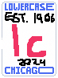
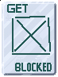
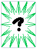
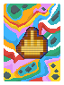

# Tic-Tac-Fuck-You
## Premise

You are playing a custom version of tic-tac-toe against a LLM, more specifically `{MODEL}`. However everything isn't as it seems, the AI has more power than you do, and will do anything to bring you to the ground... I mean anything.

The game is played on a N by K board, which starts as 3x3, however can grow with various expansion cards.

- Players: There are two players: you and the AI
- Hands: Each player starts with 5 cards and auto-refills every 2 rounds.
- Cards: Cards can be as simple as your team letter, or as complex as inverting the board. You unlock new cards based on your level, which increases every two rounds.

## Gameplay

Place cards on the board by dragging them from the bottom onto the grid. You can test this out below (the cards are quite fun to play around with).

## Scoring and Winning

Scoring is quite simple, but it can seem complicated for few. The goal is to get K cells of the same kind that belong to your team in a row. The win condition (K) is custom and controlled by the win condition cards, it starts at 3 to mimic regular tic-tac-toe, but can be as small as 2.

### But what about the different cells!

- Blocked cells count like empty cells, except they cannot be changed by you, only the AI possesses that power.
- Neutral cells count for both teams, if there is a line of neutrals and no line for another team, it is a tie.
- Lowercase cells count for your team, but cannot mix with capital cells.

### Examples

For all of these examples, assume the win length is set to 3, but these hold true for any win length.

| Lines | Outcome
|-----|-----
| X X X | Win for X
| x x x | Win for X
| ? ? ? and X X X | Win for X
| ? O O | Win for O
| X x X | No win
| # O O | No win
| ? ? ? | Tie
| ? X ? and O O O | Tie
| X X X, x x x, o o o, O O O, # # #, ? ? ? | Tie
| X X X, ? ? O | Tie

*Game states and outcomes*

# Cards

| Card | Name | Info
|----- |----- | ----
|  | X | Base card for the X team, places an X at the selected position if the cell is empty. If the cell is not empty the card is returned.
|  | O | Base card for the O team, places an O at the selected position if the cell is empty. If the cell is not empty the card is returned.
|  | Extend | Extends the board by row/column on the side closest to where the card was placed. If the card is the same distance from many sides (ie. center), it is returned.
|  | Lowercase | Lowercases a cell. If the cell is not a capital X or O, it is returned.
|  | Block | Blocks a cell. Why would you do this? This cell is only controllable by the AI.
|  | Neutralize | Makes a cell neutral, the cell must be empty. If it is not, the card is returned.
|  | Deck back | Not a card, but it is what the AI holds.

*Card list*
